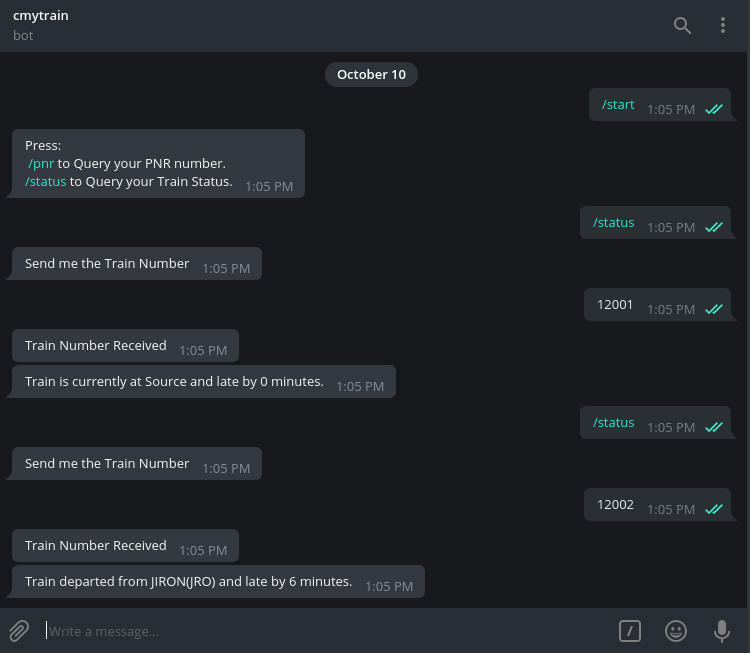

# cmytrain
Telegram BOT for Indian Railway.

# Screenshot

# Using this in Telegram.

Call the bot by its username @cmytrainbot. Then send /start to view commands that you can use. And then send the /status or /pnr
according to your requirement. Followed by Train Number or PNR Number.

# Running The Script.

In order to run this Script first goto the directory. Then activate virualenv by typing : 

  source bin/activate

Then run the file using python files/bot.py

